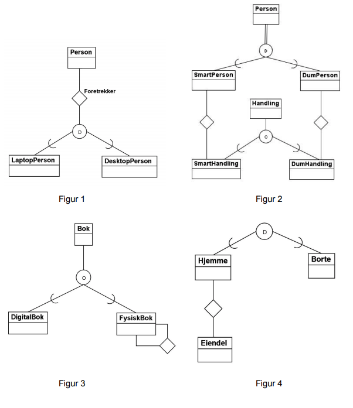

# TDT4145 - Datamodellering og databasesystemer Øving 1

Læringsmål for denne øvingen er å:

- Forstå og designe entity-relationship-modeller med spesialisering.
- Forstå relasjonsdatabasemodellen for databasesystemer.
- Forstå dataintegritet og referanseintegritet.
- Forstå relasjonsalgebra som spørrespråk og kunne konstruere enkle spørringer.

## Oppgave 1: Begrensninger og syntaks for spesialisering

a) Vi skal nå utvide ER-modellen slik at vi kan ha entiteter som danner
superklasse/subklasse-forhold. Når vi modellerer med spesialisering har vi to type
begrensninger som er mulige: Total spesialisering og disjunkte subklasser. Forklar
betydningen av disse to begrepene.

b) Disse begrensningene, totalitet og disjunksjon, er uavhengige av hverandre. Det
betyr at vi kan ha fire mulige situasjoner når vi modellerer med spesialisering:

i) Disjunkt og total
ii) Disjunkt og delvis
iii) Overlappende og total
iv) Overlappende og delvis

For hver av disse situasjonene, finn et eksempel på en miniverden der det er
hensiktsmessig å modellere med en slik begrensning.

c) Hvilke av de følgende ER-diagrammene under (figur 1-4) er (syntaktisk) gale?
Begrunn svaret ditt

- Figur 1
  - 
- Figur 4
  - Disjunkte subklasser uten noen superklasse

## Oppgave 2: ER-modellering av dyrehage

## Oppgave 3:  Viktige begreper i relasjonsdatabasemodellen

Forklar sammenhengen mellom primærnøkkel og entitetsintegritet, og sammenhengen
mellom fremmednøkkel og referanseintegritet

## Oppgave 4: Modelloversetting og relasjonsalgebra

b) Vi har oppgitt følgende database med tabeller:
  Hotell​(Hotellnr, Navn, Område)
  Hotellrom​(Romnr, Kvadratmeterstørrelse, Hotellnr)
  Hotellnr er fremmednøkkel mot Hotell og kan ikke være NULL.
  Kunde​(Kundenr, Fornavn, Etternavn, Telefonnr)
  Rombestilling​(Bestillingsnr, Startdato, Varighet, Kundenr, RomNr)
    Kundenr er fremmednøkkel mot Kunde og kan ikke være NULL. RomNr er
    fremmednøkkel mot Hotellrom og kan ikke være NULL.

Skriv spørringer i relasjonsalgebra for databasen over, som gjør følgende:

1. Hent ut hotellnr og navn på alle hoteller.

2. Hent ut hotellnr og navn på alle hoteller som ligger i Barcelona (Område = “Barcelona”)

3. Finn romnr og hotellnavn for de rom som er over 100 kvadratmeter.

4. Finn antallet bestillinger på hotellrom under 8 kvadratmeter og med varighet lengre enn 7 dager.

5. Finn fullt navn og telefonnummer på de kundene som har en rombestilling i Madrid.

6. Finn varigheten til alle rombestillinger bestilt av kunder med navn “Ole Hansen”. Sorter resultatet på varighet i stigende rekkefølge.