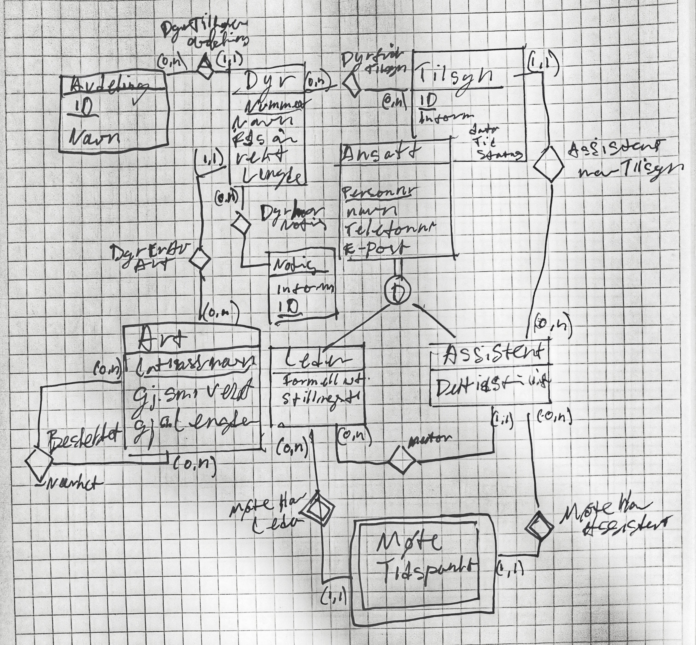
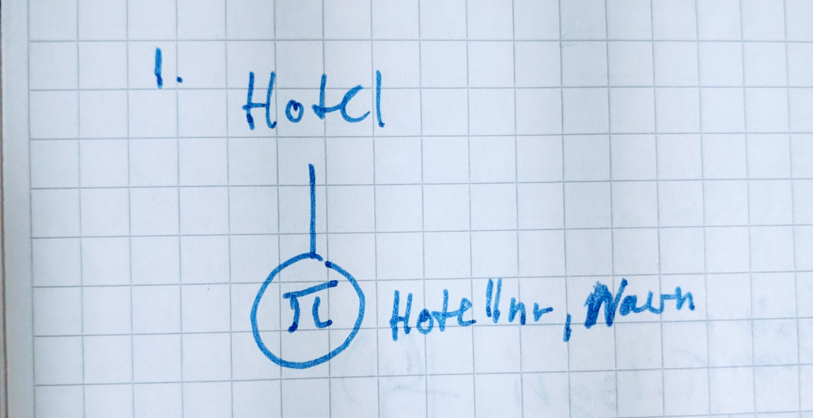
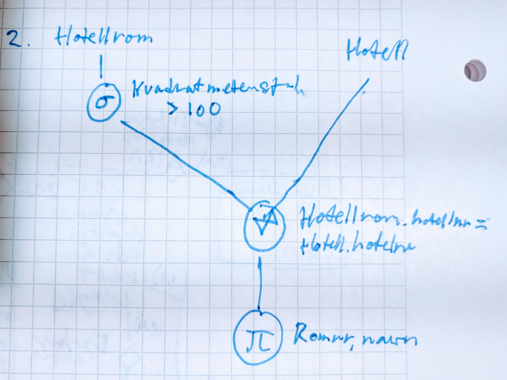
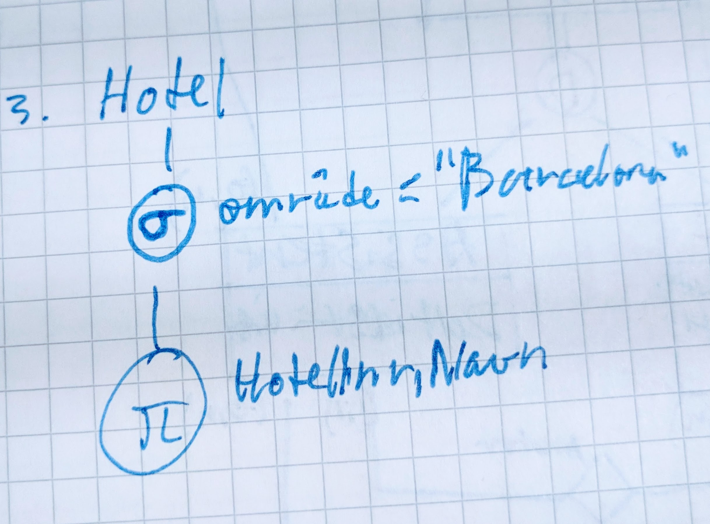
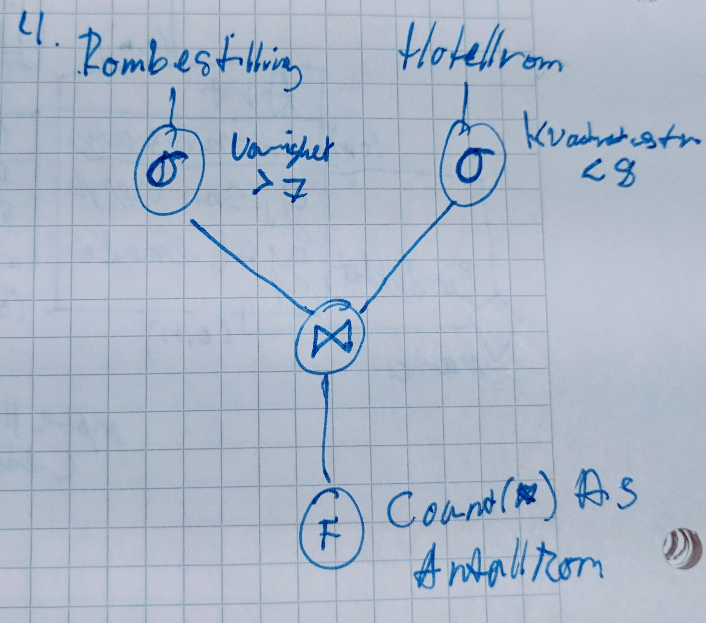
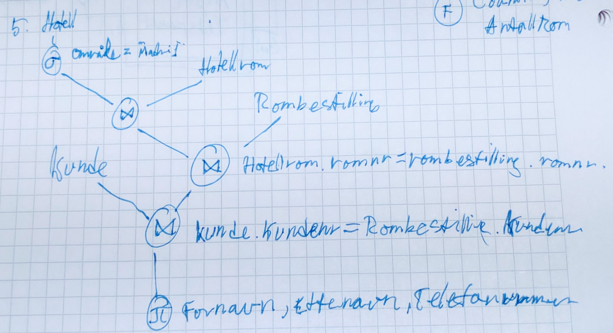
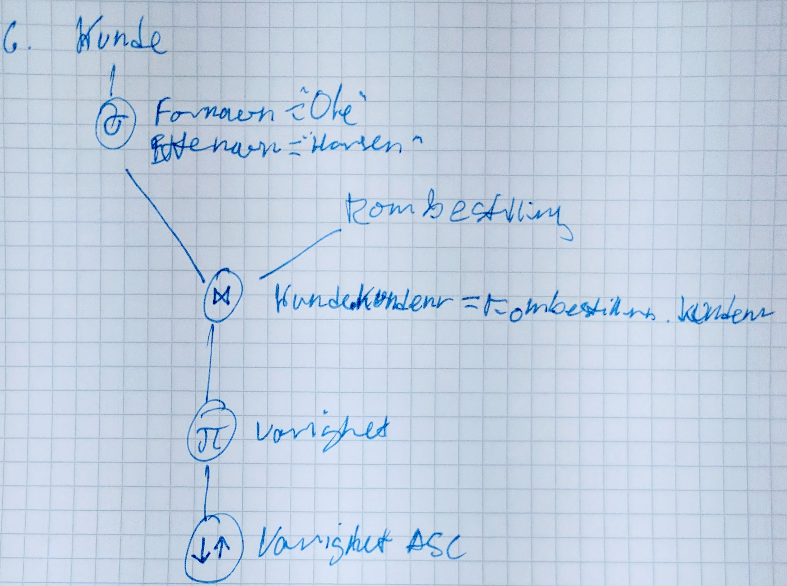

# TDT4145 - Datamodellering og databasesystemer Øving 1

Læringsmål for denne øvingen er å:

- Forstå og designe entity-relationship-modeller med spesialisering.
- Forstå relasjonsdatabasemodellen for databasesystemer.
- Forstå dataintegritet og referanseintegritet.
- Forstå relasjonsalgebra som spørrespråk og kunne konstruere enkle spørringer.

## Oppgave 1: Begrensninger og syntaks for spesialisering

a. Vi skal nå utvide ER-modellen slik at vi kan ha entiteter som danner
superklasse/subklasse-forhold. Når vi modellerer med spesialisering har vi to type
begrensninger som er mulige: **Total spesialisering** og **disjunkte subklasser**. Forklar
betydningen av disse to begrepene.

- **Total spesialisering**: alle entiteter i superklassen må være med i minst en subklasse.
- **Disjunkte subklasser**: En entitet i superklassen kan ikke delta i flere enn en subklasse.

b. Disse begrensningene, **totalitet** og **disjunksjon**, er uavhengige av hverandre. Det
betyr at vi kan ha fire mulige situasjoner når vi modellerer med spesialisering. For hver av disse situasjonene, finn et eksempel på en miniverden der det er hensiktsmessig å modellere med en slik begrensning.

1. **Disjunkt og total**
  En person kan være jente eller gutt. Ikke litt av begge. (i allefall slik det har fungert før 2016)

2. **Disjunkt og delvis**
  Kjøretøy -> personbil og taxi.
  Ett kjøretøy kan eksistere som personbil eller taxi, eller ikke være spesifisert.
  
3. **Overlappende og total**
  Ansatt -> Timelønn, provisjon.
  En ansatt må ha lønn, som kan gis enten ved timelønn, provisjon eller begge deler.

4. **Overlappende og delvis**
  Ansatt -> Timelønn, provisjon. En ansatt som kan gis enten ved timelønn, provisjon eller begge deler. Evt. være frivillig ansatt eller få lønn på andre måter.

c. Hvilke av de følgende ER-diagrammene under (figur 1-4) er (syntaktisk) gale?
Begrunn svaret ditt

**Følgende figurer har feil:**

- **Figur 1**
  - Kan ikke ha relasjon mellom superklasse og subklasse.
- **Figur 4**
  - De disjunkte subklassene "Hjemme" og "Borte" mangler en superklasse.

## Oppgave 2: ER-modellering av dyrehage

## Oppgave 3:  Viktige begreper i relasjonsdatabasemodellen

Forklar sammenhengen mellom primærnøkkel og entitetsintegritet, og sammenhengen
mellom fremmednøkkel og referanseintegritet

Entitetsintegritet: Vi har aldri to like rader/tuppler.
Dersom alle attributter i en entitet er lik i en annen entitet er det smart å ha en primærnøkkel slik at man kan skille dem fra hverandre og dermed oppnå entitetsintegritet.

Referanseintegritet: Dersom man har referanseintegritet vil det si at vi kan stole på at fremmednøkkelen peker til en entitet som eksisterer.

## Oppgave 4: Modelloversetting og relasjonsalgebra

### Oppgave 4a

- Eksamen(EksamenNr, Fagkode, hjelpemiddelkode)
- Student(StudentNr, Navn)
- Eksamenslokale(RomNr, Navn, Kapasitet)
- Bord(BordNr, type, **RomNr**)
- Stol(StolNr, type, **RomNr**)
- ***HarEksamen(StudentNr, EksamenNr)***
- ***Oppsatt(EksamenNr, StudentNr, RomNr)***

Attributten ***RomNr*** i entiteten ***Bord*** og i entiteten ***Stol*** er **fremmednøkler**.
***HarEksamen*** og ***Oppsatt*** er **relasjonstabeller**.

### Oppgave 4b

Vi har fått oppgitt følgende database med tabeller:

- Hotell​(Hotellnr, Navn, Område)
- Hotellrom​(Romnr, Kvadratmeterstørrelse, Hotellnr)
- Hotellnr er fremmednøkkel mot Hotell og kan ikke være NULL.
- Kunde​(Kundenr, Fornavn, Etternavn, Telefonnr)
- Rombestilling​(Bestillingsnr, Startdato, Varighet, Kundenr, RomNr)
- Kundenr er fremmednøkkel mot Kunde og kan ikke være NULL. RomNr er fremmednøkkel mot Hotellrom og kan ikke være NULL.

Skriv spørringer i relasjonsalgebra for databasen over, som gjør følgende:

1. Hent ut hotellnr og navn på alle hoteller.
  
2. Hent ut hotellnr og navn på alle hoteller som ligger i Barcelona (Område = “Barcelona”)
  
3. Finn romnr og hotellnavn for de rom som er over 100 kvadratmeter.
  
4. Finn antallet bestillinger på hotellrom under 8 kvadratmeter og med varighet lengre enn 7 dager.
  
5. Finn fullt navn og telefonnummer på de kundene som har en rombestilling i Madrid.
  
6. Finn varigheten til alle rombestillinger bestilt av kunder med navn “Ole Hansen”. Sorter resultatet på varighet i stigende rekkefølge.
  