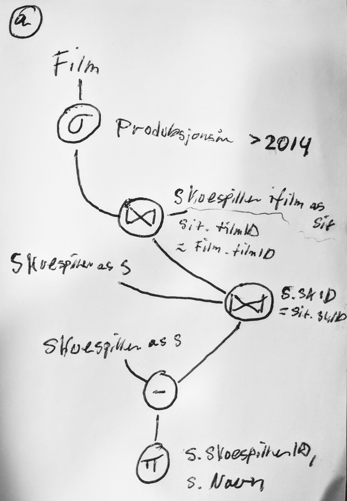
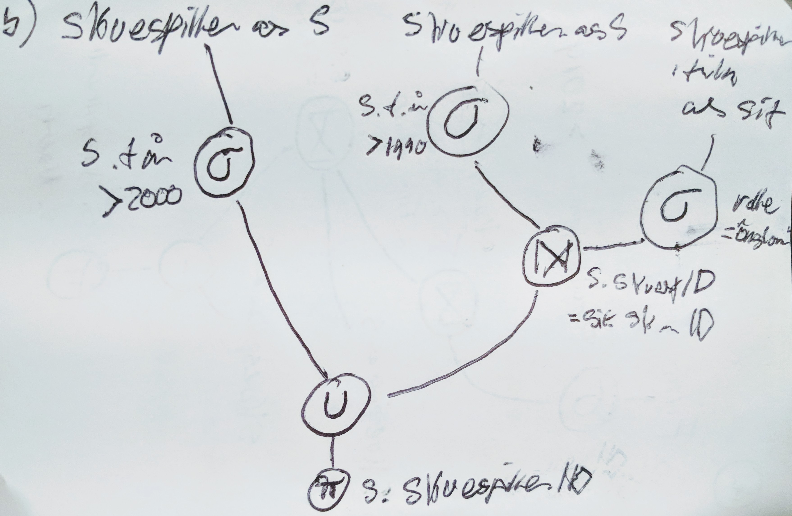
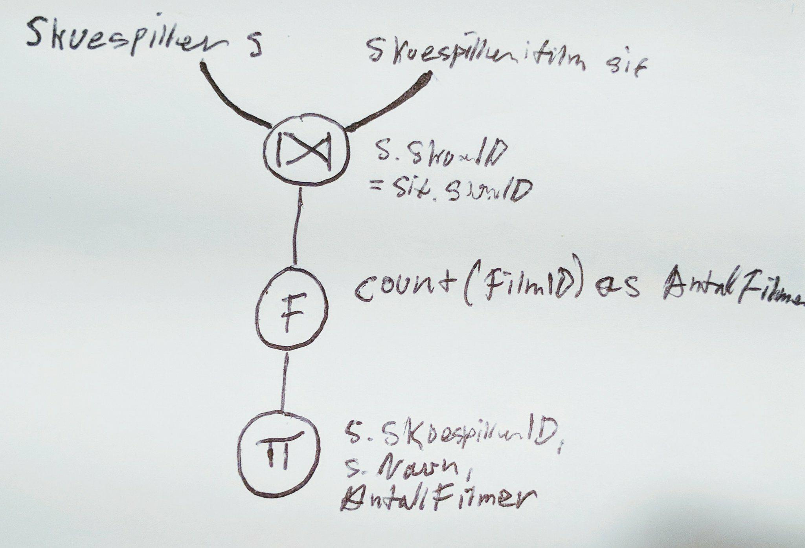

# Øving 3

## Oppgave 1: Lage SQL-tabeller og legge inn data

**a)** Vi ønsker at dersom man sletter eller oppdaterer en rad i Film-tabellen, skal
tilsvarende referanser til denne raden også slettes eller oppdateres. Dette betyr at
hvis man for eksempel sletter en film, skal SkuespillerIFilm- og
SjangerForFilm-tabellene også slette de radene der referanser til denne filmen
inngår. Hvordan kan man spesifisere en slik restriksjon i SQL?

```sql
ON DELETE CASCADE
```

**b)** Skriv nå kode som konstruerer disse tabellene i sql.

```sql
-- ENTITETS-TABELLER
CREATE TABLE Film
(
    FilmID INTEGER NOT NULL PRIMARY KEY,
    Tittel VARCHAR,
    Produksjonsår INTEGER,
    RegissørID INTEGER,
);
CREATE TABLE Sjanger
(
    SjangerID INTEGER NOT NULL PRIMARY KEY,
    Navn VARCHAR,
    Beskrivelse VARCHAR,
);
CREATE TABLE Skuespiller
(
    SkuespillerID INTEGER NOT NULL PRIMARY KEY,
    Navn VARCHAR,
    Fødselsår INTEGER,
);
CREATE TABLE Regissør
(
    RegissørID INTEGER NOT NULL PRIMARY KEY,
    Navn VARCHAR,
);
-- RELASJONS-TABELLER
CREATE TABLE SjangerForFilm
(
    FOREIGN KEY (FilmID)
        REFERENCES Film(FilmID)
        ON DELETE CASCADE,
    FOREIGN Key (SjangerID)
        REFERENCES Sjanger(SjangerID)
        ON DELETE CASCADE
)
CREATE TABLE SkuespillerIFIlm
(
    FOREIGN KEY (FilmID)
        REFERENCES Film(FilmID)
        ON DELETE CASCADE,
    FOREIGN Key (SkuespillerID)
        REFERENCES Skuespiller(SkuespillerID)
        ON DELETE CASCADE,
    Rolle VARCHAR
)
```

**c)** Skriv SQL-setninger som legger inn følgende data i databasen:

```sql
INSERT INTO Regissør(RegissørID,Navn)
VALUES (1,"Peyton Reed"),(2,"Tom Shadyac");

INSERT INTO Film(FilmID,Navn,Produksjonsår, RegissørID)
VALUES (1, 'Yes Man', 2008, 1);

INSERT INTO Skuespiller(SkuespillerID,Navn,Fødselsår)
VALUES (1,'Jim Carrey',1962);

INSERT INTO SkuespillerIFIlm(FilmID,SkuespillerID)
VALUES (1,1,"Carl")
```

**d)** Skriv en SQL-setning som oppdaterer navnet til Jim Carrey til James Eugene Carrey.

```sql
UPDATE Skuespiller
SET Navn = "Jim Eugene Carrey"
WHERE SkuespillerID = 1;
```

**e)** Skriv en SQL-setning som sletter Tom Shadyac fra databasen.

```sql
DELETE Regissør
WHERE RegissørID = 2;
```

## Oppgave 2: Spørringer i SQL

**a)** Hent ut filmID, tittel, produksjonsår og regissørID på alle filmer.

```sql
select filmID,tittel,produksjonsår, regissørID FROM film;
```
```bash
+--------+--------------------------------+----------------+-------------+
| filmID | tittel                         | produksjonsår  | regissørID  |
+--------+--------------------------------+----------------+-------------+
|      1 | Yes Man                        |           2008 |           1 |
|      2 | Ace Ventura: When Nature Calls |           1995 |           3 |
|      3 | Ace Ventura: Pet Detective     |           1994 |           2 |
|      4 | Bruce Almighty                 |           2003 |           2 |
|      5 | The Dark Knight                |           2008 |           4 |
|      6 | Batman Begins                  |           2005 |           4 |
|      7 | En eksamenvakts dagbok         |           2014 |           5 |
+--------+--------------------------------+----------------+-------------+
7 rows in set (0.00 sec)
```

**b)** Finn navn på alle skuespillere født senere enn 1960.

```sql
select navn FROM skuespiller
where Fødselsår > 1960;
```

```bash
+----------------------+
| navn                 |
+----------------------+
| Jim Carrey           |
| Zooey Deschanel      |
| Bradley Cooper       |
| John Michael Higgins |
| Rhys Darby           |
| Maynard Eziashi      |
| Courtney Cox         |
| Tone Loc             |
| Dan Marino           |
| Jennifer Aniston     |
| Catherine Bell       |
| Christian Bale       |
| Heath Ledger         |
| Aaron Eckhart        |
| Katie Holmes         |
+----------------------+
15 rows in set (0.00 sec)
```

**c)** Finn navn på alle skuespillere født på 80-tallet, sortert i alfabetisk rekkefølge.

```sql
select navn FROM skuespiller
where Fødselsår BETWEEN 1970 AND 1980;
```

```bash
+-----------------+
| navn            |
+-----------------+
| Zooey Deschanel |
| Bradley Cooper  |
| Rhys Darby      |
| Christian Bale  |
| Heath Ledger    |
| Katie Holmes    |
+-----------------+
6 rows in set (0.00 sec)
```

**d)** Finn titlene på alle filmene og de tilhørende rollene som “Morgan Freeman” har spilt.

```sql
select Tittel, Rolle FROM skuespillerifilm left join film ON skuespillerifilm.FilmID = film.FilmId
where SkuespillerID = 14;
```

```bash
+-----------------+------------+
| Tittel          | Rolle      |
+-----------------+------------+
| Bruce Almighty  | God        |
| The Dark Knight | Lucius Fox |
| Batman Begins   | Lucius Fox |
+-----------------+------------+
3 rows in set (0.00 sec)
```

**e)** Hent ut de distinkte titlene på filmene hvor regissøren og en av skuespillerne i filmen har likt navn.

```sql
SELECT DISTINCT film.Tittel FROM film JOIN skuespillerifilm ON skuespillerifilm.FilmID = film.FilmID 
JOIN skuespiller ON skuespiller.SkuespillerID = skuespillerifilm.SkuespillerID 
JOIN regissør ON regissør.RegissørID = film.RegissørID
WHERE regissør.Navn = skuespiller.Navn;
```

```bash
+------------------------+
| Tittel                 |
+------------------------+
| En eksamenvakts dagbok |
+------------------------+
1 row in set (0.00 sec)
```

**f)** Finn antallet skuespillere som har et navn som starter på “C”.

```sql
SELECT COUNT(Navn) AS "Antall skuespillere som har navn som starter med C" FROM skuespiller WHERE navn = "C%";
```

```bash
+----------------------------------------------------+
| Antall skuespillere som har navn som starter med C |
+----------------------------------------------------+
|                                                  0 |
+----------------------------------------------------+
1 row in set (0.00 sec)
```

**g)** For hver sjanger finn  sjangernavnet og antallet filmer av den sjangeren.

```sql
SELECT DISTINCT Navn AS "Sjanger", COUNT(FilmID) AS "Antall Filmer" FROM sjangerforfilm
join sjanger ON sjanger.SjangerID = sjangerforfilm.SjangerID
GROUP BY sjanger.sjangerID;
```

```bash
+-----------+---------------+
| Sjanger   | Antall Filmer |
+-----------+---------------+
| Komedie   |             5 |
| Romantikk |             2 |
| Eventyr   |             3 |
| Krim      |             3 |
| Fantasi   |             2 |
| Drama     |             3 |
| Action    |             3 |
| Thriller  |             1 |
+-----------+---------------+
8 rows in set (0.00 sec)
```

**h)** Finn navnet på skuespillere som har spilt i filmen “Ace Ventura: Pet Detective”, men aldri i filmen “Ace Ventura: When Nature Calls”.

```sql
-- <!-- Pet detective; ID = 3, Nature Calls; ID = 2 -->
SELECT s.Navn FROM skuespiller s
    JOIN skuespillerifilm sif ON sif.SkuespillerID = s.SkuespillerID
    WHERE sif.FilmID = 3 AND sif.SkuespillerID NOT IN
        (SELECT s.skuespillerID FROM skuespiller s
            JOIN skuespillerifilm sif
                ON sif.SkuespillerID = s.SkuespillerID
                WHERE sif.FilmID = 2);
```

```bash
+--------------+
| Navn         |
+--------------+
| Courtney Cox |
| Sean Young   |
| Tone Loc     |
| Dan Marino   |
+--------------+
4 rows in set (0.00 sec)
```

**i)** For hver film, finn navnet på filmen, filmID og gjennomsnittlig fødselsår på skuespillerne i filmen. Vi ønsker kun å få med de filmene som har gjennomsnittlig fødselsår større enn gjennomsnittlig fødselsår for alle skuespillerne i databasen. (Hint: Her kan det være lurt med en underspørring i en HAVING-del etter aggregeringen).

**PARSE THAT QUESTION!:** Finn filmer hvor gjennomsnittlig fødselsår på skuespillerne i en film, er større enn gjennomsnitlig alder for alle skuespillerne i databasen.

```sql
SELECT f.tittel, f.filmID, AVG(s.fødselsår) AS GjennomsnittligFødselsåriFilm FROM film f
INNER JOIN skuespillerifilm sif ON sif.filmID = f.filmID
INNER JOIN skuespiller s ON sif.skuespillerID = s.skuespillerID
GROUP BY (f.filmID)
HAVING GjennomsnittligFødselsåriFilm > (SELECT AVG(skuespiller.fødselsår) FROM skuespiller);
```

```bash
+----------------------------+--------+---------------------------------+
| tittel                     | filmID | GjennomsnittligFødselsåriFilm   |
+----------------------------+--------+---------------------------------+
| Yes Man                    |      1 |                       1970.8000 |
| Ace Ventura: Pet Detective |      3 |                       1962.4000 |
+----------------------------+--------+---------------------------------+
2 rows in set (0.00 sec)
```

## Oppgave 3: Flere spørringer i relasjonsalgebra

**a)** Finn skuespillerID og navn på de skuespillere som ikke har spilt i en film produsert etter 2014.



**b)** Hent skuespillerID, navn og fødselsår på skuespillerne som er født senere enn 2000, og de skuespillerne som er født senere enn 1990 og har spilt i en film som en ungdom (Rolle = “Ungdom”).



**c)** For hver skuespiller finn  skuespillerID, navnet og antall filmer vedkommende har spilt i.



## Oppgave 4: Introduksjon til normaliseringsteori

| PersonID | Navn          | Telefonnr | Fakultetskode | Fakultetsnavn                          | Fakultetsbygg |
| -------- | ------------- | --------- | ------------- | -------------------------------------- | ------------- |
| 270393   | Ola Johansen  | 73735667  | EDI           | Institutt for energi og datainnovasjon | Oasen         |
| 313874   | Kari Vintermo | 73739023  | EDI           | Institutt for energi og datainnovasjon | Oasen         |
| 241257   | Bernt Nilsen  | 73731234  | EDI           | Institutt for energi og datainnovasjon | Oasen         |
| 935784   | Olav Foss     | 73738471  | EDI           | Institutt for energi og datainnovasjon | Oasen         |
| 345481   | Per Høyder    | 73739021  | EDI           | Institutt for energi og datainnovasjon | Oasen         |
| 134876   | ÅseBekkerud   | 73746617  | IØA           | Institutt for økonomiske arkitekturer  | Solklossen    |

**a)** Dette er et eksempel på dårlig design. Det er fordi vi lagrer mye av den samme
informasjonen mange ganger (redundans), når vi sannsynligvis kan strukturere
tabellen på en smartere måte for å unngå dette. Vi får også problemer med
innsetting, oppdatering og sletting av data. Hvis vi for eksempel sletter en person,
kan vi risikere å helt miste informasjon om et fakultet.
Hvis fakultetet EDI endrer navn til DI (institutt for datainnovasjon), slik at både
fakultetskoden og fakultetsnavnet må endres, hvor mange felt trengs å
oppdateres?

**Svar:** 10 felt

**b)** Kan du foreslå et alternativt design som gjør at vi trenger å oppdatere færre felter
hvis EDI endrer navn?

| PersonID | Fornavn | Etternavn | Telefonnr |
| -------- | ------- | --------- | --------- |
| 270393   | Ola     | Johansen  | 73735667  |
| 313874   | Kari    | Vintermo  | 73739023  |
| 241257   | Bernt   | Nilsen    | 73731234  |
| 935784   | Olav    | Foss      | 73738471  |
| 345481   | Per     | Høyder    | 73739021  |
| 134876   | Åse     | Bekkerud  | 73746617  |

| PersonID | FakultetsID |
| -------- | ----------- |
| 270393   | 1           |
| 313874   | 1           |
| 241257   | 1           |
| 935784   | 1           |
| 345481   | 1           |
| 134876   | 2           |

| FakultetsID | Fakultetskode | Fakultetsnavn                          | Fakultetsbygg |
| ----------- | ------------- | -------------------------------------- | ------------- |
| 1           | EDI           | Institutt for energi og datainnovasjon | Oasen         |
| 2           | IØA           | Institutt for økonomiske arkitekturer  | Solklossen    |

Nå trenger man bare å oppdatere to felt ved endring av fakultetsnavn og -kode.

## Oppgave 5: Funksjonelle avhengigheter, nøkler og tillukning

**a)** Anta følgende tabell. Hvilke påstander kan umulig stemme? Begrunn svarene dine.

| $A$  | $B$  | $C$  | $D$  |
| ---- | ---- | ---- | ---- |
| $a1$ | $b1$ | $c1$ | $d1$ |
| $a1$ | $b1$ | $c2$ | $d2$ |
| $a2$ | $b1$ | $c2$ | $d2$ |
| $a3$ | $b2$ | $c3$ | $d3$ |
| $a3$ | $b2$ | $c1$ | $d1$ |
| $a4$ | $b2$ | $c4$ | $d2$ |

**1) $A \rightarrow A$**
**2) $A \rightarrow B$**
**3) $A \rightarrow C$**: går ikke fordi a1 gir to forskjellige verdier ($c1$ og $c2$)
**4) $AB \rightarrow C$**:går ikke fordi a1 og b2 gir to forskjellige verdier ($c1$ og $c2$)
**5) $C \rightarrow D$**
**6) $D \rightarrow C$**: går ikke fordi d2 gir to forskjellige verdier ($c2$ og $c4$)
**7) $ABCD$ er en supernøkkel for tabellen**
**8) $ABC$ er en supernøkkel for tabellen**
**9) $A$ er en kandidatnøkkel for tabellen**: er feil fordi vi har flere like verdier i A.
**10) $AC$ er en kandidatnøkkel for tabellen**

**b)** $X+$ kalles tillukningen av $X$ og er mengden av alle attributter som er funksjonelt
avhengig av $X$ (basert på en mengde funksjonelle avhengigheter $F$).
Gitt tabellen $R = {A, B, C, D}$ og $F = {A \rightarrow C, B\rightarrow D, ABC \rightarrow D}$.
Finn $A+$, $D+$, $BC$+ og $AB+$.

$A+ = AC$
$D+ = D$
$BC+ = BCD$
$AB+ = ABCD$